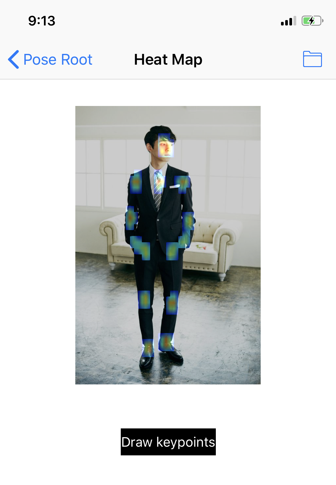
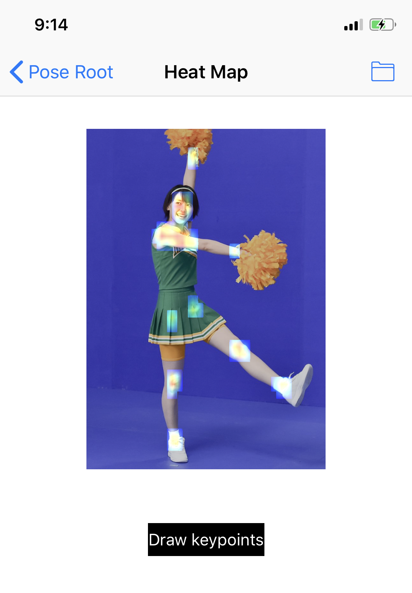
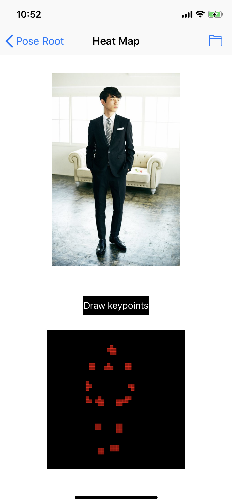
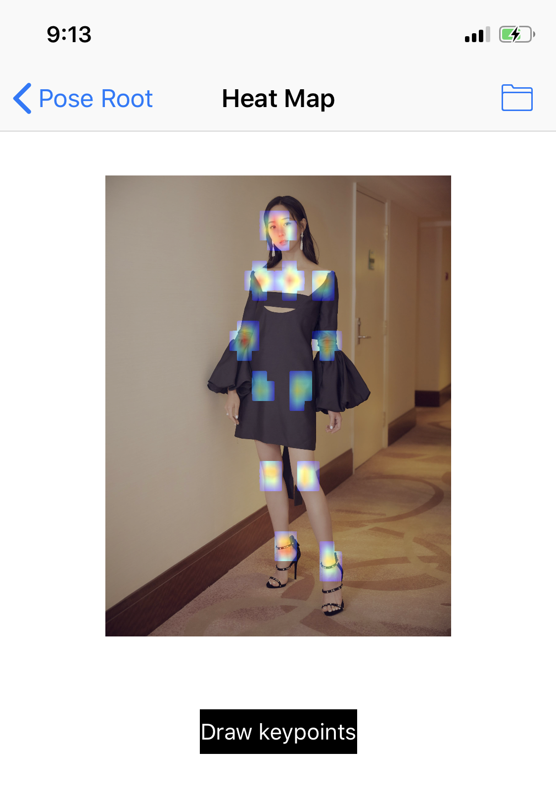
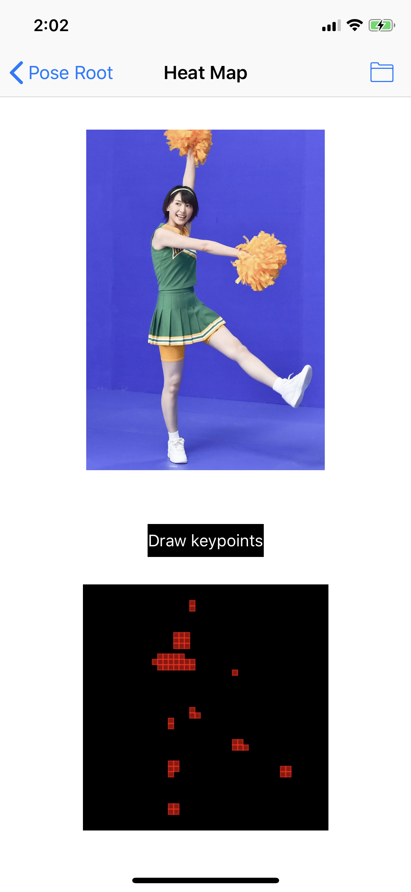
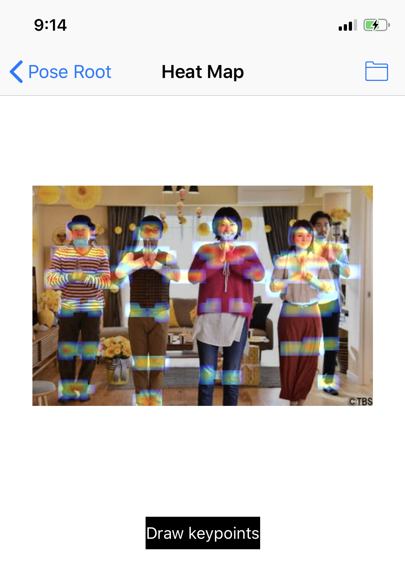

# iOS-lightweight-openpose

This work is based on the paper [Real-time 2D Multi-Person Pose Estimation on CPU: Lightweight OpenPose](https://arxiv.org/abs/1811.12004). The PyTorch weights are converted to CoreML format and deployed on iOS. 

## Convert to CoreML

The following steps shows how to convert a PyTorch model to CoreML format:

1. Clone the repo of **[Real-time 2D Multi-Person Pose Estimation on CPU: Lightweight OpenPose](https://github.com/Daniil-Osokin/lightweight-human-pose-estimation.pytorch)** and download the pretrained model from https://github.com/Daniil-Osokin/lightweight-human-pose-estimation.pytorch.

2. Move the pretrained model to \<lightweight-human-pose-estimation\>/checkpoints/

3. Copy the pytorch_to_coreml.py to \<lightweight-human-pose-estimation\>/scripts/

Excute the command under the root of \<lightweight-human-pose-estimation\>

    python3 scripts/pytorch_to_coreml.py

See pytorch_to_coreml.py for more detail information.

## Examples

### Heat Map

The positions of the keypoints are shown bellow and the confidence map will be implemented in the future.

<table>
  <tr>
    <td></td>
    <td></td>
    <td></td>
  </tr>
   <tr>
    <td></td>
    <td></td>
    <td></td>
  </tr>
</table>

## TODO

1. Change the aspect ration of the output.

2. Group the keypoints with PAF.

3. Video streaming.

## Reference

1. [Real-time 2D Multi-Person Pose Estimation on CPU: Lightweight OpenPose](https://arxiv.org/abs/1811.12004) 

2. https://github.com/Daniil-Osokin/lightweight-human-pose-estimation.pytorch

